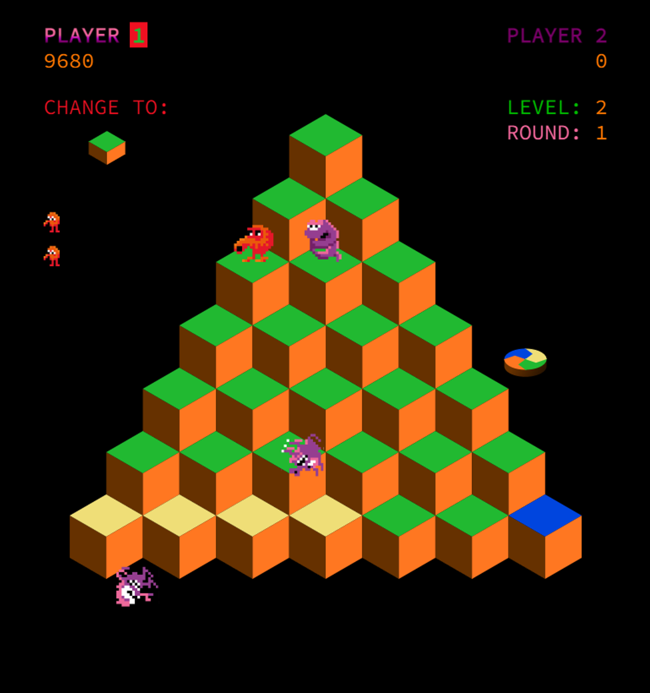

# Q*bert port in Javascript and HTML canvas

This is an adaptation of the famous [Q*bert arcade game](https://en.wikipedia.org/wiki/Q*bert), developed by Warren Davis in 1982. I am only using plain Javascript, with HTML canvas.

## Playing the game

You can play a live version directly at https://alainsmet.com/qbert/qbert.html

You can also clone this repository, or download the ZIP file, and open qbert.html. That's it !

## Game controls

You can play this game either by using the keyboard, or by clicking on the dedicated buttons.

The keyboard controls are as follow :

| Key | Action |
| Space | Insert a coin |
| 1 | One-player start |
| 2 | Two-player start |
| Arrow keys | Move Q*bert |

## Current development status

This project is currently under development, the main items that need to be implemented are :
* Collisions with enemies
* Tune the characters generator for each level / round
* Freeze the enemies when Q*bert jumps on a green ball
* Logic behind Sam and Slick when they jump on a cube
* Global interface to look nicer

